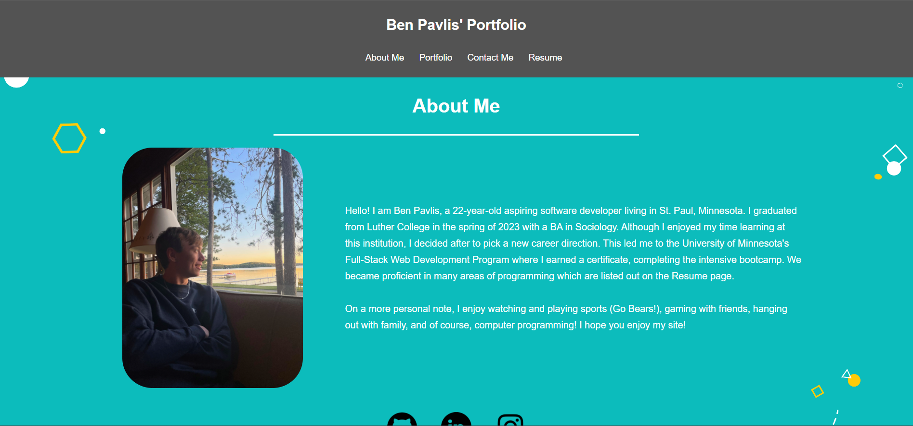

# Module 20 Challenge - Portfolio

## Description of Work
Created a Portfolio application to showcase the various projects I have completed. This project is using JS, react, react-bootstrap, and vite.

## Final Screenshot

## Links
[GitHub](https://github.com/bpavlis/portfolio)

[GitHub Pages](https://bpavlis.github.io/portfolio/)

## Additional Note
This work was completed partially using the aid of a template given to us by our instructor as well as code from the student-project in this unit, he had given us permission to do this.